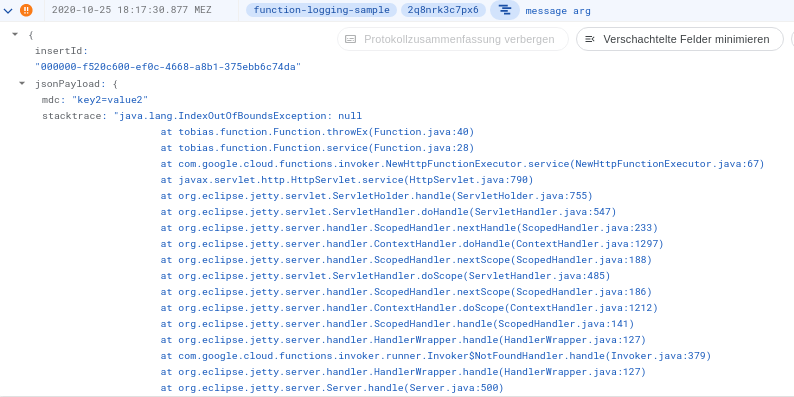

# Logging configuration for Java 11 GCP Cloud Functions

If you ever tried creating a GCP Cloud Function in Java you may have come across the question, how to configure logging
properties and enrich your log messages with more meta information. The official docs aren't detailed in a way I could
set it up in a more advanced way.

If you think, "What is this dude talking about? The docs are stating everything anyone needs to know!", then my friend
you can go on and skip this repo. For all others, here are my results, enjoy :)

## Setup

I deployed the function (`function/src/main/java/tobias/function/Function.java`) via `deploy.sh` to a GCP project. It is
a HTTP function, using the Slf4j logger interface to print some logs for demonstration purpose. So far, nothing special.

All the logging configuration happens in the `logging` module.

## Produced logs

The results are the following log messages:

```json
{
  "insertId": "000000-cda0b1fa-77f4-46d9-911b-529c9d6f4de8",
  "jsonPayload": {
    "message": "message arg",
    "stacktrace": "",
    "marker": "marker1 [ marker2, marker3 ]",
    "mdc": "key2=value2, key=value"
  },
  "resource": {
    "type": "cloud_function",
    "labels": {
      "project_id": "functions-terraform",
      "function_name": "function-logging-sample",
      "region": "europe-west3"
    }
  },
  "timestamp": "2020-10-25T17:17:30.874Z",
  "severity": "INFO",
  "labels": {
    "execution_id": "2q8nrk3c7px6"
  },
  "logName": "projects/functions-terraform/logs/cloudfunctions.googleapis.com%2Fcloud-functions",
  "trace": "projects/functions-terraform/traces/f18fd28a4c3e601c8e1aff9c3b425c55",
  "receiveTimestamp": "2020-10-25T17:17:41.816131194Z"
}
```

and

```json
{
  "insertId": "000000-f520c600-ef0c-4668-a8b1-375ebb6c74da",
  "jsonPayload": {
    "mdc": "key2=value2",
    "stacktrace": "java.lang.IndexOutOfBoundsException: null\n\tat tobias.function.Function.throwEx(Function.java:40)\n\tat tobias.function.Function.service(Function.java:28)\n\tat com.google.cloud.functions.invoker.NewHttpFunctionExecutor.service(NewHttpFunctionExecutor.java:67)\n\tat javax.servlet.http.HttpServlet.service(HttpServlet.java:790)\n\tat org.eclipse.jetty.servlet.ServletHolder.handle(ServletHolder.java:755)\n\tat org.eclipse.jetty.servlet.ServletHandler.doHandle(ServletHandler.java:547)\n\tat org.eclipse.jetty.server.handler.ScopedHandler.nextHandle(ScopedHandler.java:233)\n\tat org.eclipse.jetty.server.handler.ContextHandler.doHandle(ContextHandler.java:1297)\n\tat org.eclipse.jetty.server.handler.ScopedHandler.nextScope(ScopedHandler.java:188)\n\tat org.eclipse.jetty.servlet.ServletHandler.doScope(ServletHandler.java:485)\n\tat org.eclipse.jetty.server.handler.ScopedHandler.nextScope(ScopedHandler.java:186)\n\tat org.eclipse.jetty.server.handler.ContextHandler.doScope(ContextHandler.java:1212)\n\tat org.eclipse.jetty.server.handler.ScopedHandler.handle(ScopedHandler.java:141)\n\tat org.eclipse.jetty.server.handler.HandlerWrapper.handle(HandlerWrapper.java:127)\n\tat com.google.cloud.functions.invoker.runner.Invoker$NotFoundHandler.handle(Invoker.java:379)\n\tat org.eclipse.jetty.server.handler.HandlerWrapper.handle(HandlerWrapper.java:127)\n\tat org.eclipse.jetty.server.Server.handle(Server.java:500)\n\tat org.eclipse.jetty.server.HttpChannel.lambda$handle$1(HttpChannel.java:383)\n\tat org.eclipse.jetty.server.HttpChannel.dispatch(HttpChannel.java:547)\n\tat org.eclipse.jetty.server.HttpChannel.handle(HttpChannel.java:375)\n\tat org.eclipse.jetty.server.HttpConnection.onFillable(HttpConnection.java:270)\n\tat org.eclipse.jetty.io.AbstractConnection$ReadCallback.succeeded(AbstractConnection.java:311)\n\tat org.eclipse.jetty.io.FillInterest.fillable(FillInterest.java:103)\n\tat org.eclipse.jetty.io.ChannelEndPoint$2.run(ChannelEndPoint.java:117)\n\tat org.eclipse.jetty.util.thread.strategy.EatWhatYouKill.runTask(EatWhatYouKill.java:336)\n\tat org.eclipse.jetty.util.thread.strategy.EatWhatYouKill.doProduce(EatWhatYouKill.java:313)\n\tat org.eclipse.jetty.util.thread.strategy.EatWhatYouKill.tryProduce(EatWhatYouKill.java:171)\n\tat org.eclipse.jetty.util.thread.strategy.EatWhatYouKill.run(EatWhatYouKill.java:129)\n\tat org.eclipse.jetty.util.thread.ReservedThreadExecutor$ReservedThread.run(ReservedThreadExecutor.java:388)\n\tat org.eclipse.jetty.util.thread.QueuedThreadPool.runJob(QueuedThreadPool.java:806)\n\tat org.eclipse.jetty.util.thread.QueuedThreadPool$Runner.run(QueuedThreadPool.java:938)\n\tat java.base/java.lang.Thread.run(Thread.java:834)\n",
    "marker": "",
    "message": "message arg"
  },
  "resource": {
    "type": "cloud_function",
    "labels": {
      "project_id": "functions-terraform",
      "function_name": "function-logging-sample",
      "region": "europe-west3"
    }
  },
  "timestamp": "2020-10-25T17:17:30.877Z",
  "severity": "ERROR",
  "labels": {
    "execution_id": "2q8nrk3c7px6"
  },
  "logName": "projects/functions-terraform/logs/cloudfunctions.googleapis.com%2Fcloud-functions",
  "trace": "projects/functions-terraform/traces/f18fd28a4c3e601c8e1aff9c3b425c55",
  "receiveTimestamp": "2020-10-25T17:17:41.816131194Z"
}
```

Side fact: The `\n` in the `stacktrace` are decoded and correctly visualised in the log-explorer.



## What, why, how?

If you look closely, there isn't any magic involved. It is just a plain old `logback.xml`:
```xml
<configuration>
    <appender name="STDOUT" class="ch.qos.logback.core.ConsoleAppender">
        <filter class="tobias.logging.SampleFilter"/>

        <encoder>
            <pattern>
                {"severity": "%level", "marker": "%marker", "mdc": "%mdc", "message": "%message", "stacktrace": "%replace(%xThrowable){'\n', '\\n'}"}%nopex%n
            </pattern>
        </encoder>
    </appender>

    <root level="info">
        <appender-ref ref="STDOUT"/>
    </root>
</configuration>
```

But let us go into more detail. Google Logging has the feature to interpret every log message printed to stdout as JSON
provided the message is a valid JSON string. This template makes heavy use of this feature, setting the log level with
the special key `severity`. The message displayed in the collapsed log entry is available from the `message` key. Per
default Google Logging puts the complete json object (without `severity`) into the `jsonPayload` property.

This enables advanced features like `Marker` and `MDC` to be available in our log messages. Stacktraces are in a
separate key while escaping every newline because every line is being interpreted as a new log message.

The last feature I made use of is the implementation of a custom filter. This way I am able to ignore log messages based
on a simple predicate.

## That's it.

Nothing more or less to learn about. Hope it sparkled joy :)
